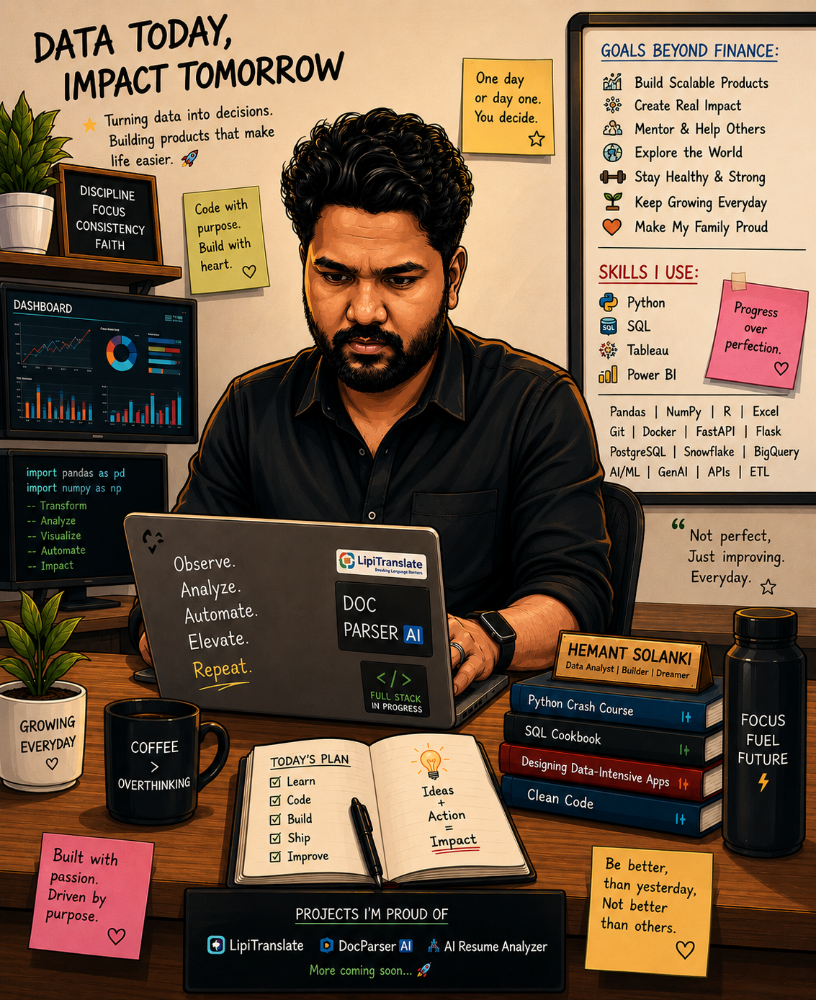

<div align="center">

  

  <h1>Hemant Solanki</h1>

  <p>
    <strong>Assistant Manager - AI & Data at Reliance Group</strong><br />
    Agentic AI Builder | GenAI | Automation | Decision Intelligence
  </p>

  <p>
    <a href="https://github.com/earlywinter96">
      
    </a>
    <a href="https://www.linkedin.com/in/hemant-solanki-366462199/">
      
    </a>
    <a href="https://my-portfolio2-peach-six.vercel.app/">
      
    </a>
  </p>

  <h3>Data Today, Impact Tomorrow</h3>

</div>

---

### About Me

I build practical AI and data products that turn messy information into clear decisions. My work sits at the intersection of analytics, automation, document intelligence, and real-world product building.

I like projects that answer useful questions:

- Can this document become structured knowledge?
- Can this workflow become faster, simpler, and smarter?
- Can AI help a person decide what to do next, not just generate text?
- Can data products make life easier for teams, users, and businesses?

```sql
SELECT impact
FROM daily_work
WHERE curiosity = true
  AND shipping = 'consistent'
  AND purpose = 'real world value';
```

---

### Currently Building

- **LipiTranslate**: PDF translation for Indian languages, built toward a larger Indic document intelligence vision.
- **DocParser AI**: AI-powered document parsing to extract clean, usable information from files.
- **AI Resume & Job Analyzer**: Resume and JD matching with ATS-style scoring, skill gap analysis, and honest career guidance.
- **NIA**: Voice and AI assistant experiments using Gemini, speech recognition, and text-to-speech workflows.
- **Automation tools**: Small systems that reduce repeated work and improve decision speed.

---

### Featured Projects

<table>
  <tr>
    <td width="50%">
      <h3><a href="https://github.com/earlywinter96/pdf-translator-ai">LipiTranslate</a></h3>
      <p>PDF Translator AI for Indian language access and document intelligence.</p>
      <p><a href="https://www.lipitranslate.in/">Live App</a></p>
      <p><strong>Stack:</strong> Python, AI APIs, PDF workflows, translation systems</p>
    </td>
    <td width="50%">
      <h3><a href="https://github.com/earlywinter96/docparser-ai">DocParser AI</a></h3>
      <p>AI document parsing app for transforming files into structured, usable data.</p>
      <p><a href="https://docparser-ai.vercel.app">Live App</a></p>
      <p><strong>Stack:</strong> HTML, AI workflows, document processing</p>
    </td>
  </tr>
  <tr>
    <td width="50%">
      <h3><a href="https://github.com/earlywinter96/ai-resume-job-analyzer">AI Resume Job Analyzer</a></h3>
      <p>Resume and job-description analyzer with ATS logic, skill matching, fit recommendations, and improvement suggestions.</p>
      <p><strong>Stack:</strong> Python, Flask, Gemini API, HTML, CSS</p>
    </td>
    <td width="50%">
      <h3><a href="https://github.com/earlywinter96/AI-Agent-NIA-">AI Agent NIA</a></h3>
      <p>Python-based AI chatbot using Gemini API, speech recognition, and text-to-speech for natural interaction.</p>
      <p><strong>Stack:</strong> Python, Gemini API, Speech Recognition, TTS</p>
    </td>
  </tr>
  <tr>
    <td width="50%">
      <h3><a href="https://github.com/earlywinter96/rentease">RentEase</a></h3>
      <p>Odoo Hackathon 2025 project for sports equipment rental management.</p>
      <p><strong>Stack:</strong> Python, Flask, database workflows</p>
    </td>
    <td width="50%">
      <h3><a href="https://github.com/earlywinter96/stackit">StackIt</a></h3>
      <p>Minimal Q&A forum platform built during the Odoo Hackathon journey.</p>
      <p><strong>Stack:</strong> HTML, web app fundamentals</p>
    </td>
  </tr>
</table>

---

### Toolbox

<p>
  
  
  
  
  
  
  
  
  
  
  
  
  
  
  
</p>

---

### How I Think About Work

```text
Observe.
Analyze.
Automate.
Elevate.
Repeat.
```

- Build with purpose.
- Keep improving every day.
- Make products that create real impact.
- Prefer progress over perfection.
- Be better than yesterday, not better than others.

---

### GitHub Snapshot

<table>
  <tr>
    <td><strong>Public Repositories</strong></td>
    <td>14 and growing</td>
  </tr>
  <tr>
    <td><strong>Main Build Zone</strong></td>
    <td>AI apps, data tools, document intelligence, automation, and portfolio experiments</td>
  </tr>
  <tr>
    <td><strong>Most Used Languages</strong></td>
    <td>Python, HTML, CSS, JavaScript, SQL</td>
  </tr>
  <tr>
    <td><strong>Recent Focus</strong></td>
    <td>LipiTranslate, DocParser AI, AI Resume Job Analyzer, NIA, StackIt, RentEase</td>
  </tr>
</table>

<p align="center">
  <a href="https://github.com/earlywinter96?tab=repositories">
    
  </a>
  <a href="https://github.com/earlywinter96/pdf-translator-ai">
    
  </a>
  <a href="https://github.com/earlywinter96/docparser-ai">
    
  </a>
</p>

---

### Connect

- Portfolio: [my-portfolio2-peach-six.vercel.app](https://my-portfolio2-peach-six.vercel.app/)
- LinkedIn: [linkedin.com/in/hemant-solanki-366462199](https://www.linkedin.com/in/hemant-solanki-366462199/)
- GitHub: [github.com/earlywinter96](https://github.com/earlywinter96)

<div align="center">

  <strong>Not perfect. Just improving. Everyday.</strong>

</div>
